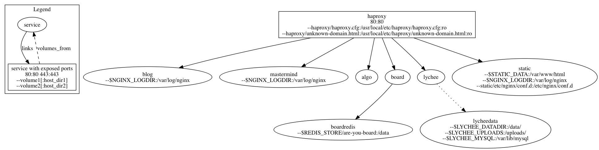

abesto.net and *.abesto.net, run on Docker. (The host happens to be Ubuntu 14.04.1 at Linode)

Requirements:
 - [Docker](https://www.docker.com/)
 - [docker-compose](http://www.fig.sh/)

## Running locally
```sh
. ./env/dev/bin/activate # Load env variables for volume mount points for running locally (there's also prod, used in production, obviously)
docker-compose pull    # Pull the latest version of all relevant docker repos. Also do this to update versions.
docker-compose up -d   # Start the whole shebang
curl $(boot2docker ip) -H 'Host: abesto.net'  # Look at the blog; use 127.0.0.1 if on Linux and not using boot2docker
docker-compose stop    # Stop and delete containers
```

## What's included


Graph generated with https://github.com/abesto/docker-compose-graphviz

 * HAProxy (routes by `Host` header)
  * [blog](https://github.com/abesto/blog) (host [abesto.net](http://abesto.net))
  * [are-you-board](https://github.com/abesto/are-you-board) (host [board.abesto.net](http://board.abesto.net))
    * A standalone Redis container serving as the database for `are-you-board`
  * [mastermind](https://github.com/abesto/mastermind) (host [mastermind.abesto.net](http://mastermind.abesto.net))
  * [algo](https://github.com/abesto/algo) (host [algo.abesto.net](http://algo.abesto.net))
  * [lychee](https://github.com/electerious/Lychee) (host [lychee.abesto.net](http://lychee.abesto.net))
    * The actual content is on the host FS, mounted as a volume into the docker container
  * Static stuff at [static.abesto.net](http://static.abesto.net), aliased to [releases.abesto.net](http://releases.abesto.net)
    * The actual content is on the host FS, mounted as a volume into the docker container
